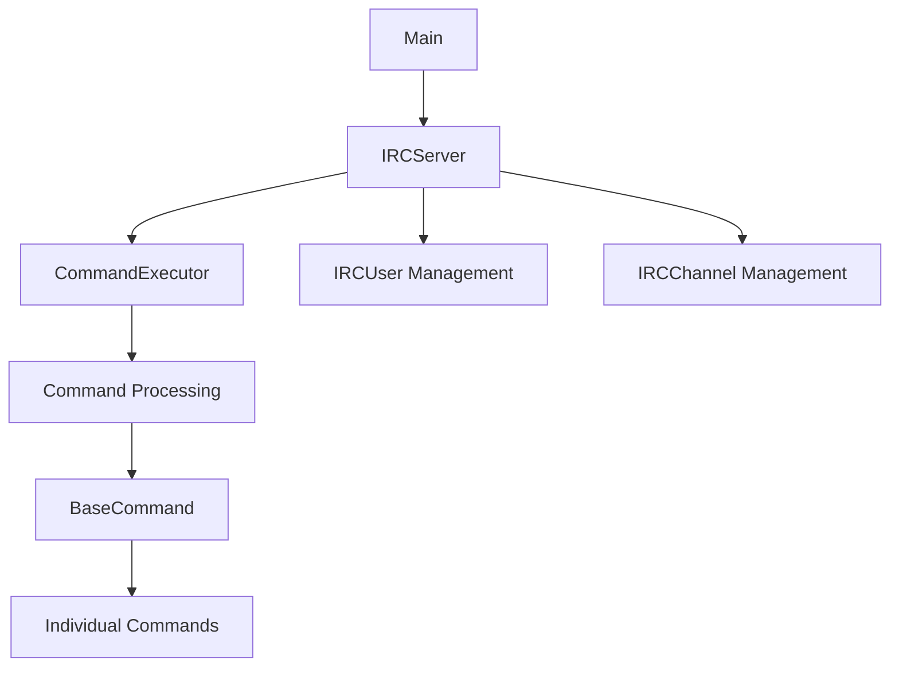
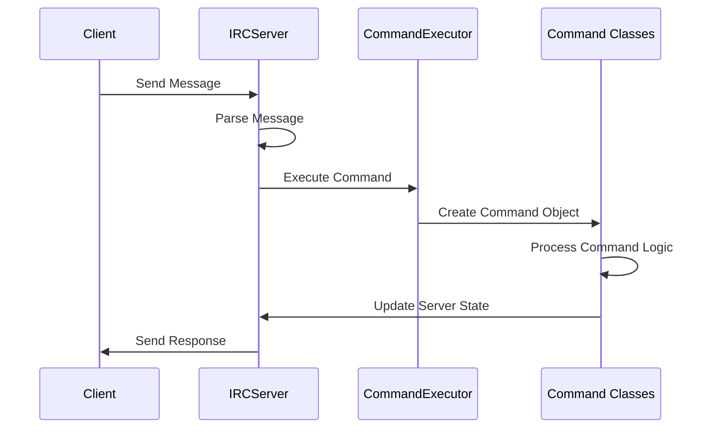

# Project Architecture

## Overview

The IRC server is designed with a modular architecture that separates concerns into distinct components. This design allows for maintainability, extensibility, and clear code organization.

## Core Components



### Key Files Organization

| Component | Files | Purpose |
|-----------|-------|---------|
| Core | `main.cpp`, `IRCServer.cpp/hpp` | Entry point and server management |
| Commands | `BaseCommand.cpp/hpp`, `*Command.cpp/hpp` | Command handling system |
| Entities | `IRCUser.cpp/hpp`, `IRCChannel.cpp/hpp` | Data structures for users and channels |
| Utilities | `IRCUtilities.cpp/hpp`, `LogManager.cpp/hpp` | Helper functions and logging |
| Responses | `NumericResponses.hpp` | IRC response codes |

## Directory Structure

```
IRC/
├── inc/                    # Header files
│   ├── commands/           # Command class headers
│   ├── entities/           # Entity class headers
│   ├── IRCDependencies.hpp # Common includes
│   ├── ...
├── srcs/                   # Source files
│   ├── commands/           # Command implementations
│   ├── entities/           # Entity implementations
│   ├── ...
├── Makefile                # Build system
```

## Design Patterns

The project implements several design patterns:

1. **Command Pattern**: Used to encapsulate command requests as objects
2. **Factory Pattern**: For command creation and management
3. **Singleton Pattern**: Used for the server and logger instances

## Data Flow



## Memory Management

Memory management follows RAII principles where possible, despite using C++98 standards. Key considerations:

- User objects are owned by the server and deleted when a user disconnects
- Channel objects are managed by the server and deleted when empty
- Command objects are created on demand and have a defined lifecycle

## Connection Handling

The server uses non-blocking sockets with the poll() system call to handle multiple client connections efficiently. This approach allows the server to:

1. Accept new connections without blocking
2. Read from clients when data is available
3. Write responses back to clients
4. Handle timeouts and disconnections

For more details on specific components, see:
- [[command-system|Command System Architecture]]
- [[entity-management|Entity Management]]
- [[server-implementation|Server Implementation Details]]

