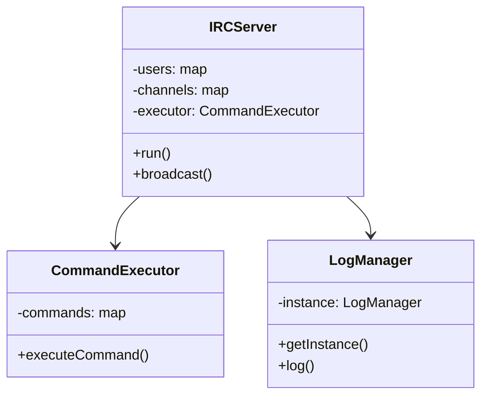
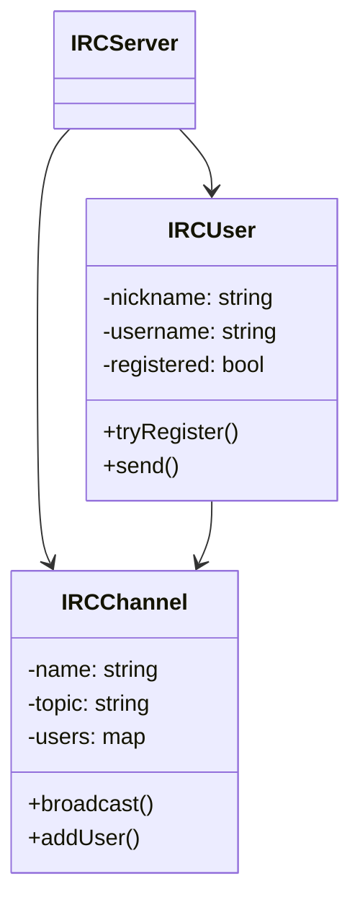
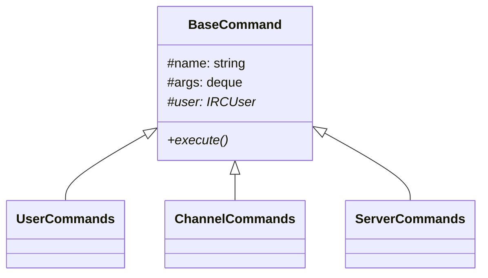
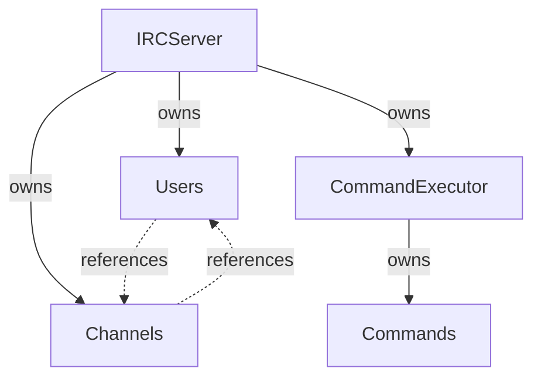

# Class Hierarchy

## Core Classes Overview

### Server Components

### Entity Classes

## Command System

### Base Command Structure

### Command Implementations

#### Connection Commands
| Command | Purpose | Key Methods |
|---------|---------|-------------|
| PassCommand | Password authentication | `execute()`, verify password |
| NickCommand | Set/change nickname | `execute()`, validate nickname |
| UserCommand | User registration | `execute()`, process user info |

#### Channel Commands
| Command | Purpose | Key Methods |
|---------|---------|-------------|
| JoinCommand | Join channels | `execute()`, channel access |
| PartCommand | Leave channels | `execute()`, departure handling |
| KickCommand | Remove users | `execute()`, permission check |
| InviteCommand | Channel invitations | `execute()`, invite processing |
| TopicCommand | Manage topics | `execute()`, topic handling |
| ModeCommand | Channel modes | `execute()`, mode management |

#### Communication Commands
| Command | Purpose | Key Methods |
|---------|---------|-------------|
| PrivmsgCommand | Send messages | `execute()`, message routing |
| PingCommand | Connection check | `execute()`, server response |
| QuitCommand | Disconnect | `execute()`, cleanup |

## Class Details

### IRCServer Class
Main server class managing:
- User connections
- Channel creation/management
- Command processing
- Message routing

Key Methods:
- `run()`: Main server loop
- `broadcast()`: Server-wide messages
- `findUserByName()`: User lookup
- `findChannelByName()`: Channel lookup

### IRCUser Class
Represents connected users:
- Connection state
- User identity
- Channel membership
- Message handling

Key Methods:
- `tryRegister()`: Registration
- `sendMessage()`: Communication
- `joinChannel()`: Channel operations

### IRCChannel Class
Manages chat channels:
- User list
- Channel properties
- Message broadcasting
- Access control

Key Methods:
- `broadcast()`: Channel messages
- `addUser()`: User management
- `setTopic()`: Topic control
- `setMode()`: Mode management

## Extension Points
The system can be extended through:
1. New command classes (inherit BaseCommand)
2. Additional entity features
3. Enhanced logging capabilities
4. Extended channel modes

See [[adding-commands]] for implementation details.

## Memory Management

For more details on implementation, see:
- [[command-system|Command System]]
- [[entity-management|Entity Management]]
- [[server-implementation|Server Implementation]]
