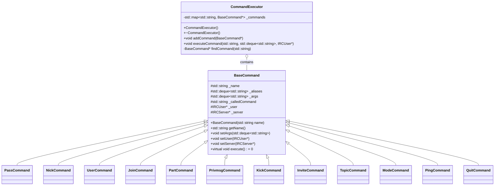
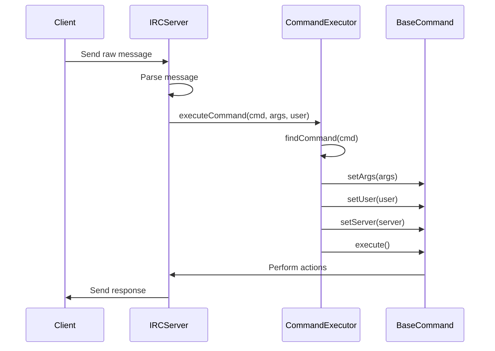

# Command System

## Overview

The command system is a core component of the IRC server, responsible for parsing, validating, and executing client commands. It's built around the Command Pattern, which encapsulates commands as objects with a standard interface.

## Architecture



## Command Processing Flow



## BaseCommand Class

The `BaseCommand` abstract class is the foundation of the command system:

```cpp
class BaseCommand {
protected:
    std::string                     _name;
    std::deque<std::string>         _aliases;
    std::deque<std::string>         _args;
    std::string                     _calledCommand;
    IRCUser                        *_user;
    IRCServer                      *_server;
    
public:
    BaseCommand(std::string name);
    virtual ~BaseCommand(void);
    
    std::string             getName(void) const;
    std::deque<std::string> getAliases(void) const;
    
    void    setArgs(std::deque<std::string> args);
    void    setUser(IRCUser *user);
    void    setServer(IRCServer *server);
    void    setCalledCommand(std::string calledCommand);
    void    addAlias(std::string alias);
    
    bool    hasAlias(std::string alias) const;
    
    virtual void    execute(void) const = 0;
};
```

All command classes inherit from `BaseCommand` and implement the `execute()` method with their specific behavior.

## CommandExecutor Class

The `CommandExecutor` class manages all command instances and handles the execution process:

```cpp
class CommandExecutor {
private:
    std::map<std::string, BaseCommand*> _commands;
    
public:
    CommandExecutor();
    ~CommandExecutor();
    
    void addCommand(BaseCommand* command);
    void executeCommand(std::string command, std::deque<std::string> args, IRCUser* user);
    
private:
    BaseCommand* findCommand(std::string command);
};
```

Key features:
- Stores commands in a map for O(log n) lookup
- Supports command aliases
- Handles command validation
- Manages command lifecycle

## Command Registration

Commands are registered with the executor during initialization:

```cpp
CommandExecutor::CommandExecutor() {
    // Register all commands
    this->addCommand(new PassCommand());
    this->addCommand(new NickCommand());
    this->addCommand(new UserCommand());
    this->addCommand(new JoinCommand());
    this->addCommand(new PartCommand());
    this->addCommand(new PrivmsgCommand());
    this->addCommand(new KickCommand());
    // ... more commands
}
```

When a command is registered, both its primary name and any aliases are added to the command map.

## Command Execution Process

1. Server receives a message from a client
2. Message is parsed into command and arguments
3. `executeCommand()` is called with the command name, arguments, and user
4. `findCommand()` locates the appropriate command object
5. Command object is configured with arguments, user, and server
6. Command's `execute()` method is called
7. Command performs its actions and updates server state
8. Server sends responses back to clients

## Command Validation

Commands validate their arguments and check user permissions:

```cpp
void SomeCommand::execute() const {
    // Check if enough arguments
    if (this->_args.size() < 1) {
        // Send error: not enough parameters
        return;
    }
    
    // Check if user is authenticated
    if (!this->_user->isRegistered()) {
        // Send error: not registered
        return;
    }
    
    // Command-specific validation
    
    // Command execution logic
}
```

## Command Examples

### NICK Command Implementation

```cpp
void NickCommand::execute() const {
    // Check if command has arguments
    if (this->_args.empty()) {
        this->_server->sendNumericReply(this->_user, ERR_NONICKNAMEGIVEN, ":No nickname given");
        return;
    }
    
    std::string nickname = this->_args[0];
    
    // Validate nickname format
    if (!isValidNickname(nickname)) {
        this->_server->sendNumericReply(this->_user, ERR_ERRONEUSNICKNAME, nickname + " :Erroneous nickname");
        return;
    }
    
    // Check if nickname is already in use
    if (this->_server->findUser(nickname)) {
        this->_server->sendNumericReply(this->_user, ERR_NICKNAMEINUSE, nickname + " :Nickname is already in use");
        return;
    }
    
    // Set the new nickname
    this->_user->setNickname(nickname);
    
    // Notify channels about the nickname change
    // ...
}
```

## Related Pages

- [[commands|IRC Commands Reference]]
- [[message-flow|Message Processing Flow]]
- [[adding-commands|Adding New Commands]]
- [[entity-management|Entity Management]]

