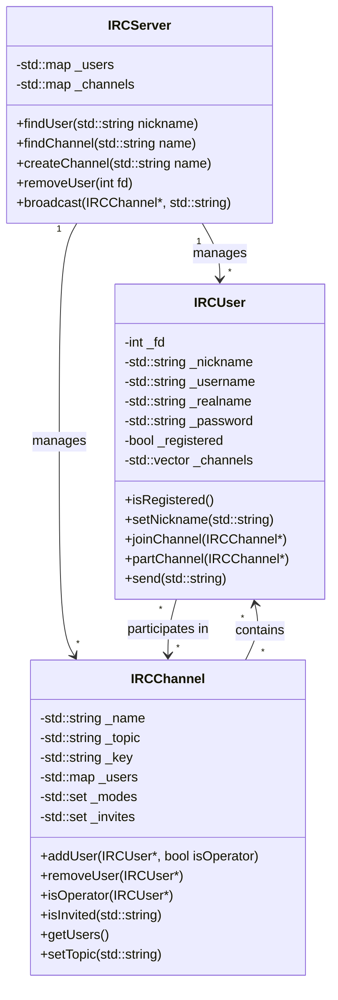
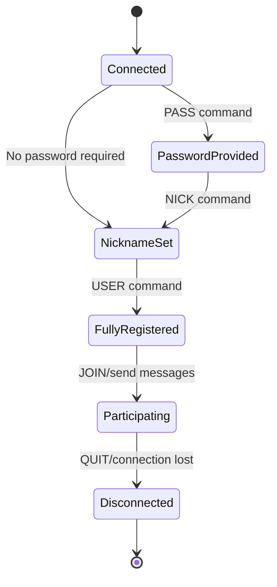

# Entity Management

## Overview

The IRC server manages two primary entity types:
1. **Users** - Clients connected to the server
2. **Channels** - Discussion rooms that users can join

This document details how these entities are structured, managed, and interact with each other within the IRC server implementation.

## Entity Relationships



## User Management

### IRCUser Class Structure

The `IRCUser` class represents a client connected to the IRC server:

```cpp
class IRCUser {
private:
    int                     _fd;            // Socket file descriptor
    std::string             _nickname;      // IRC nickname
    std::string             _username;      // Username part of identity
    std::string             _realname;      // Real name of the user
    std::string             _password;      // Password (if used)
    std::string             _hostname;      // Client's hostname
    bool                    _registered;    // Full registration status
    bool                    _passAccepted;  // Pass command received and valid
    std::vector<IRCChannel*> _channels;     // Channels the user is in
    std::set<std::string>   _modes;         // User modes
    
public:
    IRCUser(int fd);
    ~IRCUser();
    
    // Getters
    int             getFd() const;
    std::string     getNickname() const;
    std::string     getUsername() const;
    std::string     getRealname() const;
    std::string     getHostname() const;
    bool            isRegistered() const;
    bool            isInChannel(IRCChannel* channel) const;
    
    // Setters
    void            setNickname(std::string nickname);
    void            setUsername(std::string username);
    void            setRealname(std::string realname);
    void            setPassword(std::string password);
    void            setHostname(std::string hostname);
    void            setRegistered(bool registered);
    void            setPassAccepted(bool passAccepted);
    
    // Channel management
    void            joinChannel(IRCChannel* channel);
    void            partChannel(IRCChannel* channel);
    void            partAllChannels();
    
    // Mode management
    bool            hasMode(std::string mode) const;
    void            addMode(std::string mode);
    void            removeMode(std::string mode);
    
    // Network operations
    void            send(std::string message);
};
```

### User State Management

An `IRCUser` object goes through several states during its lifecycle:

1. **Connected**: User has connected but not authenticated
2. **Password Provided**: User has provided a password (if required)
3. **Nickname Set**: User has set a nickname
4. **Fully Registered**: User has completed registration with USER command
5. **Participating**: User joins/parts channels and sends messages
6. **Disconnected**: User quits or connection is lost



### Authentication Flow

The authentication process verifies a user's identity before allowing full participation:

```cpp
// In IRCServer class
void IRCServer::processRegistration(IRCUser* user) {
    // Check if user has provided all necessary registration info
    if (user->getNickname().empty() || user->getUsername().empty()) {
        return; // Not enough information yet
    }
    
    // Check if password is required and provided
    if (!this->_password.empty() && !user->isPassAccepted()) {
        user->send(":" + this->_serverName + " 464 * :Password required\r\n");
        return;
    }
    
    // Mark user as registered
    user->setRegistered(true);
    
    // Send welcome messages
    user->send(":" + this->_serverName + " 001 " + user->getNickname() + 
              " :Welcome to the Internet Relay Network " + 
              user->getNickname() + "!" + user->getUsername() + "@" + 
              user->getHostname() + "\r\n");
    // Additional welcome messages...
}
```

## Channel Management

### IRCChannel Class Structure

The `IRCChannel` class represents a chat room where multiple users can communicate:

```cpp
class IRCChannel {
private:
    std::string                 _name;      // Channel name
    std::string                 _topic;     // Channel topic
    std::string                 _key;       // Channel password (if any)
    std::map<IRCUser*, bool>    _users;     // Map of users (bool = isOperator)
    std::set<std::string>       _modes;     // Channel modes
    std::set<std::string>       _invites;   // Invited nicknames (for +i mode)
    unsigned int                _userLimit; // User limit (for +l mode)
    
public:
    IRCChannel(std::string name);
    ~IRCChannel();
    
    // Getters
    std::string     getName() const;
    std::string     getTopic() const;
    std::string     getKey() const;
    unsigned int    getUserLimit() const;
    
    // Setters
    void            setTopic(std::string topic);
    void            setKey(std::string key);
    void            setUserLimit(unsigned int limit);
    
    // User management
    void            addUser(IRCUser* user, bool isOperator = false);
    void            removeUser(IRCUser* user);
    bool            hasUser(IRCUser* user) const;
    bool            isOperator(IRCUser* user) const;
    void            setOperator(IRCUser* user, bool op);
    std::map<IRCUser*, bool> getUsers() const;
    unsigned int    getUserCount() const;
    
    // Mode management
    bool            hasMode(std::string mode) const;
    void            addMode(std::string mode);
    void            removeMode(std::string mode);
    
    // Invite management
    void            addInvite(std::string nickname);
    bool            isInvited(std::string nickname) const;
    void            removeInvite(std::string nickname);
};
```

### Channel Operations

#### Joining a Channel

```cpp
// In JoinCommand::execute()
void JoinCommand::execute() const {
    if (this->_args.empty()) {
        this->_server->sendNumericReply(this->_user, ERR_NEEDMOREPARAMS, "JOIN :Not enough parameters");
        return;
    }
    
    std::string channelName = this->_args[0];
    std::string key = (this->_args.size() > 1) ? this->_args[1] : "";
    
    // Validate channel name
    if (channelName[0] != '#' && channelName[0] != '&' && channelName[0] != '+' && channelName[0] != '!') {
        this->_server->sendNumericReply(this->_user, ERR_NOSUCHCHANNEL, channelName + " :No such channel");
        return;
    }
    
    // Get or create channel
    IRCChannel* channel = this->_server->findChannel(channelName);
    if (!channel) {
        channel = this->_server->createChannel(channelName);
        // First user becomes operator
        channel->addUser(this->_user, true);
    } else {
        // Check if channel has key (password) protection
        if (channel->hasMode("k") && channel->getKey() != key) {
            this->_server->sendNumericReply(this->_user, ERR_BADCHANNELKEY, channelName + " :Cannot join channel (+k)");
            return;
        }
        
        // Check if channel is invite-only
        if (channel->hasMode("i") && !channel->isInvited(this->_user->getNickname())) {
            this->_server->sendNumericReply(this->_user, ERR_INVITEONLYCHAN, channelName + " :Cannot join channel (+i)");
            return;
        }
        
        // Check if channel has user limit
        if (channel->hasMode("l") && channel->getUserCount() >= channel->getUserLimit()) {
            this->_server->sendNumericReply(this->_user, ERR_CHANNELISFULL, channelName + " :Cannot join channel (+l)");
            return;
        }
        
        // Add user to channel
        channel->addUser(this->_user);
    }
    
    // Add channel to user's joined channels
    this->_user->joinChannel(channel);
    
    // Broadcast join message
    std::string joinMsg = ":" + this->_user->getNickname() + "!" + this->_user->getUsername() + "@" + 
                         this->_user->getHostname() + " JOIN " + channelName + "\r\n";
    this->_server->broadcast(channel, joinMsg);
    
    // Send channel topic
    if (!channel->getTopic().empty()) {
        this->_server->sendNumericReply(this->_user, RPL_TOPIC, channelName + " :" + channel->getTopic());
    } else {
        this->_server->sendNumericReply(this->_user, RPL_NOTOPIC, channelName + " :No topic is set");
    }
    
    // Send names list
    this->_server->sendNamesList(this->_user, channel);
}
```

#### Channel Modes

Channel modes control various aspects of channel behavior:

| Mode | Description |
|------|-------------|
| i | Invite-only channel |
| t | Only operators can change topic |
| k | Channel has a password (key) |
| o | User is a channel operator |
| l | Channel has a user limit |

```cpp
// In ModeCommand::execute() for channel modes
void ModeCommand::execute() const {
    // ... argument validation ...
    
    std::string target = this->_args[0];
    
    // Check if target is a channel
    if (target[0] == '#' || target[0] == '&' || target[0] == '+' || target[0] == '!') {
        IRCChannel* channel = this->_server->findChannel(target);
        if (!channel) {
            this->_server->sendNumericReply(this->_user, ERR_NOSUCHCHANNEL, target + " :No such channel");
            return;
        }
        
        // Check if user is operator for mode changes
        if (this->_args.size() > 1 && !channel->isOperator(this->_user)) {
            this->_server->sendNumericReply(this->_user, ERR_CHANOPRIVSNEEDED, target + " :You're not channel operator");
            return;
        }
        
        // Mode query
        if (this->_args.size() == 1) {
            std::string modeStr = "+";
            if (channel->hasMode("i")) modeStr += "i";
            if (channel->hasMode("t")) modeStr += "t";
            if (channel->hasMode("k")) modeStr += "k";
            if (channel->hasMode("l")) modeStr += "l";
            
            this->_server->sendNumericReply(this->_user, RPL_CHANNELMODEIS, target + " " + modeStr);
            return;
        }
        
        // Mode changes
        std::string modeString = this->_args[1];
        bool adding = true;
        
        for (size_t i = 0; i < modeString.length(); i++) {
            char c = modeString[i];
            
            if (c == '+') {
                adding = true;
                continue;
            } else if (c == '-') {
                adding = false;
                continue;
            }
            
            switch (c) {
                case 'i': // Invite-only
                    if (adding) channel->addMode("i");
                    else channel->removeMode("i");
                    break;
                    
                case 't': // Topic restriction
                    if (adding) channel->addMode("t");
                    else channel->removeMode("t");
                    break;
                    
                case 'k': // Key (password)
                    if (adding) {
                        if (this->_args.size() > 2) {
                            channel->setKey(this->_args[2]);
                            channel->addMode("k");
                        }
                    } else {
                        channel->removeMode("k");
                        channel->setKey("");
                    }
                    break;
                    
                case 'o': // Operator status
                    if (this->_args.size() > 2) {
                        IRCUser* targetUser = this->_server->findUser(this->_args[2]);
                        if (targetUser && channel->hasUser(targetUser)) {
                            channel->setOperator(targetUser, adding);
                        }
                    }
                    break;
                    
                case 'l': // User limit
                    if (adding) {
                        if (this->_args.size() > 2) {
                            unsigned int limit = IRCUtilities::stoi(this->_args[2]);
                            channel->setUserLimit(limit);
                            channel->addMode("l");
                        }
                    } else {
                        channel->removeMode("l");
                    }
                    break;
            }
        }
        
        // Broadcast mode change
        std::string modeMsg = ":" + this->_user->getNickname() + "!" + this->_user->getUsername() + "@" + 
                             this->_user->getHostname()

