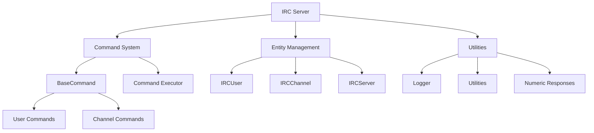

# IRC Server Project

Welcome to the IRC Server project documentation. This documentation provides a comprehensive overview of the Internet Relay Chat (IRC) server implementation.

## 📚 Documentation Sections

### Core Concepts
- [[architecture|Project Architecture]]
- [[irc-protocol|IRC Protocol Overview]]
- [[setup|Setup and Usage]]

### Implementation Details
- [[server-implementation|Server Implementation]]
- [[command-system|Command System]]
- [[entity-management|Entity Management]]
- [[utilities|Utility Functions]]

### Components
- [[class-hierarchy|Class Hierarchy]]
- [[commands|Commands Reference]]
- [[numeric-responses|Numeric Responses]]
- [[message-flow|Message Flow]]

### How-To Guides
- [[adding-commands|Adding New Commands]]
- [[client-connection|Client Connection Flow]]
- [[channel-operations|Channel Operations]]

## 🔍 Project Overview

This IRC server is a C++ implementation of the Internet Relay Chat protocol as specified in RFC 1459 and its extensions. It provides a platform for real-time text messaging, supporting multiple channels, private messaging, and various administrative commands.

**Key Features:**
- Multi-client support
- Channel management
- User authentication
- Command processing system
- Extensible architecture

## 📊 Project Structure Map

## 🧩 Implementation Details

The server is built using C++98 standards, focusing on reliability and performance. The architecture follows object-oriented design principles with a clear separation of concerns:

- **Server Core**: Handles network connections, client registration, and message routing
- **Command System**: Processes and executes user commands
- **Entity Management**: Manages users, channels, and server state
- **Utilities**: Provides supporting functionality like logging and string manipulation

For more details, explore the linked documentation pages.

