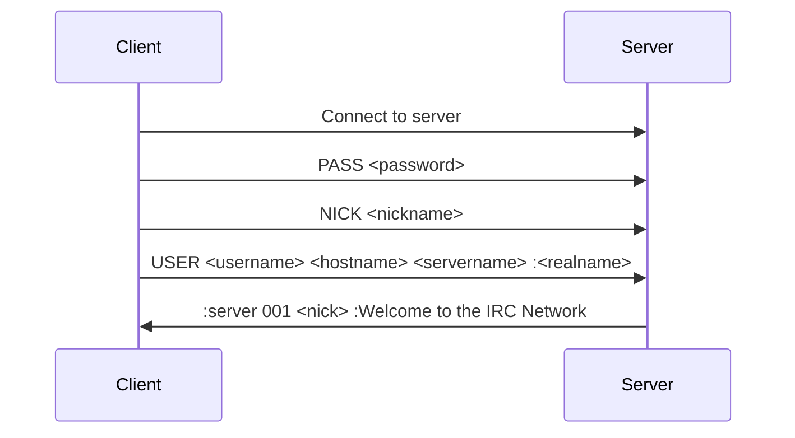

# IRC Protocol

## Introduction

Internet Relay Chat (IRC) is a text-based chat system for instant messaging. IRC is designed for group communication in discussion forums, called channels, but also allows one-on-one communication via private messages.

## Protocol Basics

IRC is a client-server protocol that uses TCP. The standard ports are:
- 6667 (default, unencrypted)
- 6697 (SSL/TLS)

Our implementation uses port 6667 by default, configurable via command-line arguments.

## IRC Message Format

IRC messages follow this format:

```
[:<prefix>] <command> <parameters> [:trailing parameter]
```

- **Prefix**: Optional. Indicates the sender of the message.
- **Command**: The IRC command or numeric reply.
- **Parameters**: Zero or more parameters for the command.
- **Trailing parameter**: Optional. A parameter that may contain spaces.

Example:
```
:nick!user@host PRIVMSG #channel :Hello, world!
```

## Connection Process



## Implemented Commands

Our server implements the following IRC commands:

| Command | Description | Usage |
|---------|-------------|-------|
| [[commands#PASS\|PASS]] | Set a connection password | PASS password |
| [[commands#NICK\|NICK]] | Set or change nickname | NICK nickname |
| [[commands#USER\|USER]] | Specify username, hostname, etc. | USER username hostname servername :realname |
| [[commands#JOIN\|JOIN]] | Join a channel | JOIN #channel [key] |
| [[commands#PART\|PART]] | Leave a channel | PART #channel [:reason] |
| [[commands#PRIVMSG\|PRIVMSG]] | Send message to user or channel | PRIVMSG target :message |
| [[commands#NOTICE\|NOTICE]] | Send notice to user or channel | NOTICE target :message |
| [[commands#PING\|PING]] | Check connection | PING :server |
| [[commands#PONG\|PONG]] | Reply to PING | PONG :server |
| [[commands#QUIT\|QUIT]] | Disconnect from server | QUIT [:reason] |
| [[commands#MODE\|MODE]] | Change channel/user modes | MODE target [+/-]modes [parameters] |
| [[commands#TOPIC\|TOPIC]] | Set/get channel topic | TOPIC #channel [:new topic] |
| [[commands#INVITE\|INVITE]] | Invite user to channel | INVITE user #channel |
| [[commands#KICK\|KICK]] | Remove user from channel | KICK #channel user [:reason] |

## Numeric Responses

IRC servers send numeric responses to indicate success, errors, or information. For example:

| Code | Meaning | Example |
|------|---------|---------|
| 001  | Welcome | :server 001 nick :Welcome to the IRC Network |
| 331  | No Topic | :server 331 nick #channel :No topic is set |
| 332  | Topic | :server 332 nick #channel :The channel topic |
| 353  | Names Reply | :server 353 nick = #channel :nick1 @nick2 +nick3 |
| 366  | End of Names | :server 366 nick #channel :End of /NAMES list |
| 401  | No Such Nick | :server 401 nick badnick :No such nick/channel |
| 403  | No Such Channel | :server 403 nick #badchan :No such channel |
| 461  | Need More Params | :server 461 nick COMMAND :Not enough parameters |
| 473  | Channel Invite Only | :server 473 nick #channel :Cannot join channel (+i) |
| 482  | Not Channel Operator | :server 482 nick #channel :You're not a channel operator |

For a complete list of implemented numeric responses, see [[numeric-responses]].

## Channel Types and Modes

Our IRC server supports the following channel types:

- **Regular channels** (#channel): Standard channels that anyone can join
- **Private channels** (!channel): Not shown in channel listing but otherwise like regular channels
- **Secret channels** (&channel): Not shown in channel listing and more restrictive

Channel modes:

- **i**: Invite-only
- **t**: Only operators can change topic
- **k**: Channel requires a key (password)
- **o**: Channel operator status
- **l**: Limited number of users

## User Modes

User modes in our implementation:

- **o**: Operator status
- **i**: Invisible (not shown in global WHO/NAMES)

## Further Reading

- [[server-implementation|Server Implementation Details]]
- [[command-system|Command System Architecture]]
- [[message-flow|Message Flow and Processing]]
- [RFC 1459](https://tools.ietf.org/html/rfc1459) - Internet Relay Chat Protocol
- [RFC 2812](https://tools.ietf.org/html/rfc2812) - Internet Relay Chat: Client Protocol

