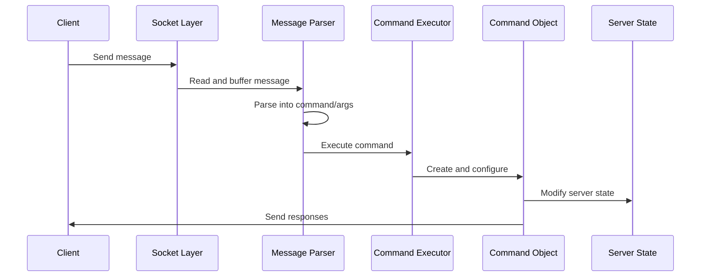
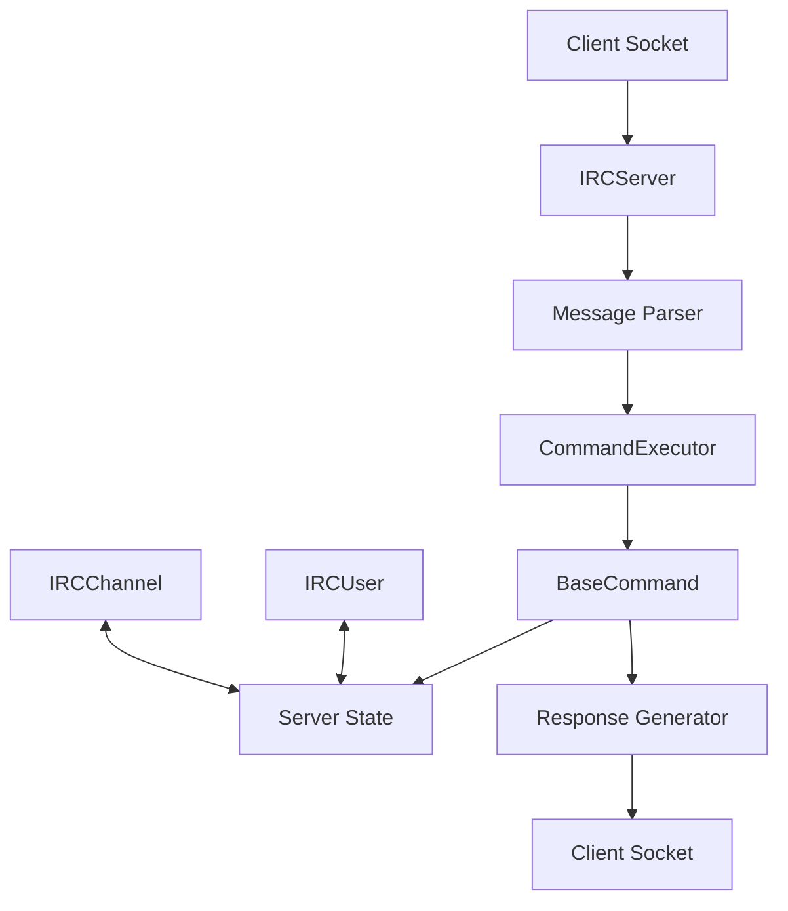
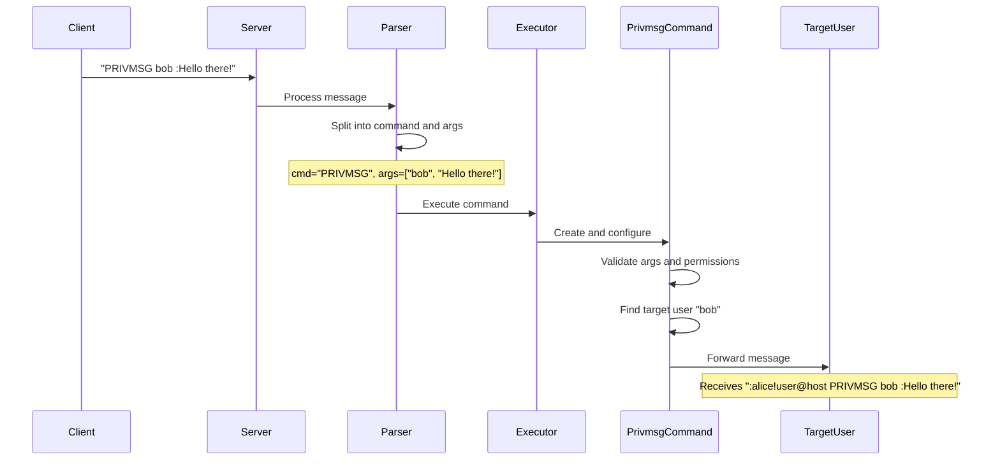

# Message Flow

This document describes the complete lifecycle of a message in the IRC server, from initial reception to command execution and response handling.

## Overview

The IRC server processes messages through a series of distinct stages:

1. Socket event detection
2. Message reception
3. Message parsing
4. Command identification
5. Command execution
6. Response generation
7. Response transmission



## 1. Socket Event Detection

The IRC server uses non-blocking I/O with `poll()` to efficiently handle multiple client connections. This allows the server to detect socket events (new connections, data available, disconnections) without blocking.

```cpp
// Main event loop in IRCServer::run()
void IRCServer::run() {
    // Set up listening socket
    // ...
    
    while (this->_running) {
        // Wait for activity on the file descriptors
        int ready = poll(this->_fds, this->_nfds, -1);
        
        if (ready == -1) {
            // Handle poll error
            continue;
        }
        
        // Check for new connections on the server socket
        if (this->_fds[0].revents & POLLIN) {
            // Accept new client
            this->acceptNewClient();
        }
        
        // Check for data from existing clients
        for (unsigned int i = 1; i < this->_nfds; i++) {
            if (this->_fds[i].revents & POLLIN) {
                // Data available for reading
                this->processClientMessage(this->_fds[i].fd);
            } else if (this->_fds[i].revents & (POLLHUP | POLLERR)) {
                // Client disconnected or error
                this->disconnectClient(this->_fds[i].fd);
            }
        }
    }
}
```

## 2. Message Reception

When data is available on a client socket, the server reads it into a buffer, handling partial messages and buffer overflow conditions.

```cpp
void IRCServer::processClientMessage(int fd) {
    char buffer[512];  // IRC messages are limited to 512 bytes
    int nbytes;
    
    // Read data from client socket
    nbytes = recv(fd, buffer, sizeof(buffer) - 1, 0);
    
    if (nbytes <= 0) {
        // Client disconnected or error
        this->disconnectClient(fd);
        return;
    }
    
    // Null-terminate the buffer
    buffer[nbytes] = '\0';
    
    // Get the user for this socket
    IRCUser* user = this->findUserByFd(fd);
    if (!user) {
        // Should not happen, but handle it anyway
        return;
    }
    
    // Process the received data
    this->processMessage(user, buffer);
}
```

## 3. Message Parsing

Messages are parsed according to the IRC protocol format:

```
[:<prefix>] <command> <parameters> [:<trailing parameter>]
```

The server splits the message into its components and handles special cases like trailing parameters.

```cpp
void IRCServer::processMessage(IRCUser* user, const std::string& message) {
    LogManager::getInstance()->log("Received: " + message);
    
    // Split message by CR/LF
    std::deque<std::string> lines = IRCUtilities::split(message, "\r\n");
    
    for (size_t i = 0; i < lines.size(); i++) {
        std::string line = lines[i];
        if (line.empty()) {
            continue;
        }
        
        // Parse prefix if present
        std::string prefix = "";
        if (line[0] == ':') {
            size_t spacePos = line.find(' ');
            if (spacePos != std::string::npos) {
                prefix = line.substr(1, spacePos - 1);
                line = line.substr(spacePos + 1);
            } else {
                // Malformed message
                continue;
            }
        }
        
        // Parse command and parameters
        std::deque<std::string> parts = IRCUtilities::split(line, " ");
        if (parts.empty()) {
            continue;
        }
        
        std::string command = parts[0];
        parts.pop_front();
        
        // Handle trailing parameter (after :)
        std::deque<std::string> args;
        for (size_t j = 0; j < parts.size(); j++) {
            if (parts[j][0] == ':') {
                // Combine remaining parts as trailing parameter
                std::string trailing = parts[j].substr(1);
                for (size_t k = j + 1; k < parts.size(); k++) {
                    trailing += " " + parts[k];
                }
                args.push_back(trailing);
                break;
            } else {
                args.push_back(parts[j]);
            }
        }
        
        // Execute the command
        this->executeCommand(command, args, user);
    }
}
```

## 4. Command Identification

Once the message is parsed, the server identifies the appropriate command to execute based on the command name.

```cpp
void IRCServer::executeCommand(const std::string& command, const std::deque<std::string>& args, IRCUser* user) {
    // Convert command to uppercase for case-insensitive comparison
    std::string upperCmd = command;
    std::transform(upperCmd.begin(), upperCmd.end(), upperCmd.begin(), ::toupper);
    
    // Log command
    std::string logMsg = "User " + user->getNickname() + " executed command: " + upperCmd;
    for (size_t i = 0; i < args.size(); i++) {
        logMsg += " " + args[i];
    }
    LogManager::getInstance()->log(logMsg);
    
    // Execute command using CommandExecutor
    this->_executor->executeCommand(upperCmd, args, user);
}
```

## 5. Command Execution

The `CommandExecutor` class looks up the appropriate command object and executes it.

```cpp
void CommandExecutor::executeCommand(const std::string& command, const std::deque<std::string>& args, IRCUser* user) {
    // Find the command
    BaseCommand* cmd = this->findCommand(command);
    
    if (!cmd) {
        // Unknown command
        this->_server->sendNumericReply(user, ERR_UNKNOWNCOMMAND, command + " :Unknown command");
        return;
    }
    
    // Configure the command
    cmd->setArgs(args);
    cmd->setUser(user);
    cmd->setServer(this->_server);
    cmd->setCalledCommand(command);
    
    // Execute the command
    cmd->execute();
}

BaseCommand* CommandExecutor::findCommand(const std::string& command) {
    // Check if command exists in the map
    std::map<std::string, BaseCommand*>::iterator it = this->_commands.find(command);
    
    if (it != this->_commands.end()) {
        return it->second;
    }
    
    return NULL;
}
```

## 6. Command Processing

Each command's `execute()` method implements its specific logic:

1. Validate arguments and user permissions
2. Update server state (users, channels, etc.)
3. Send responses to clients

Example: JOIN command implementation:

```cpp
void JoinCommand::execute() const {
    // Check if user is registered
    if (!this->_user->isRegistered()) {
        this->_server->sendNumericReply(this->_user, ERR_NOTREGISTERED, ":You have not registered");
        return;
    }
    
    // Check if enough arguments
    if (this->_args.empty()) {
        this->_server->sendNumericReply(this->_user, ERR_NEEDMOREPARAMS, "JOIN :Not enough parameters");
        return;
    }
    
    // Parse channel and key lists
    std::string channelStr = this->_args[0];
    std::string keyStr = (this->_args.size() > 1) ? this->_args[1] : "";
    
    std::deque<std::string> channels = IRCUtilities::split(channelStr, ",");
    std::deque<std::string> keys = IRCUtilities::split(keyStr, ",");
    
    // Process each channel
    for (size_t i = 0; i < channels.size(); i++) {
        std::string channelName = channels[i];
        std::string key = (i < keys.size()) ? keys[i] : "";
        
        // Join channel logic...
        // 1. Find or create channel
        // 2. Check channel modes
        // 3. Add user to channel
        // 4. Send notifications
    }
}
```

## 7. Data Flow Between Components

The flow of data between components follows this general pattern:



### Data transformations:

1. Raw bytes → String buffer
2. String buffer → Command and arguments
3. Command and arguments → Command object execution
4. Command execution → State changes
5. State changes → Response messages
6. Response messages → Raw bytes

## 8. Response Handling

Responses from the server to clients can be:

1. **Numeric Replies**: Standard numeric responses defined by the IRC protocol
2. **Command Responses**: Responses to specific commands
3. **Broadcasts**: Messages sent to multiple clients, such as channel messages

### Numeric Replies

The server uses the `sendNumericReply()` method to send standardized numeric responses:

```cpp
void IRCServer::sendNumericReply(IRCUser* user, int numeric, const std::string& message) {
    std::string reply = ":" + this->_serverName + " " + 
                       IRCUtilities::toString(numeric) + " " + 
                       (user->getNickname().empty() ? "*" : user->getNickname()) + 
                       " " + message + "\r\n";
    
    user->send(reply);
}
```

### Direct Responses

Some commands send direct responses to the user:

```cpp
void PingCommand::execute() const {
    if (this->_args.empty()) {
        this->_server->sendNumericReply(this->_user, ERR_NEEDMOREPARAMS, "PING :Not enough parameters");
        return;
    }
    
    // Send PONG response
    std::string response = ":" + this->_server->getServerName() + " PONG " + 
                          this->_server->getServerName() + " :" + this->_args[0] + "\r\n";
    this->_user->send(response);
}
```

### Broadcasts

For messages that need to be sent to multiple users (like channel messages):

```cpp
void IRCServer::broadcast(IRCChannel* channel, const std::string& message) {
    std::map<IRCUser*, bool> users = channel->getUsers();
    
    for (std::map<IRCUser*, bool>::iterator it = users.begin(); it != users.end(); ++it) {
        it->first->send(message);
    }
}
```

## 9. Error Handling

The server implements error handling at various levels:

### 1. Socket-level errors

```cpp
if (socket_fd == -1) {
    LogManager::getInstance()->error("Failed to create socket: " + std::string(strerror(errno)));
    exit(EXIT_FAILURE);
}
```

### 2. Protocol-level errors

```cpp
// In NickCommand::execute
if (this->_server->findUser(nickname) && this->_server->findUser(nickname) != this->_user) {
    this->_server->sendNumericReply(this->_user, ERR_NICKNAMEINUSE, 
                                  nickname + " :Nickname is already in use");
    return;
}
```

### 3. Command-level errors

```cpp
// In TopicCommand::execute
if (!channel->hasUser(this->_user)) {
    this->_server->sendNumericReply(this->_user, ERR_NOTONCHANNEL, 
                                  channelName + " :You're not on that channel");
    return;
}
```

## 10. Full Message Lifecycle Example

To illustrate the complete lifecycle, let's trace a `PRIVMSG` command:



### Code path:

1. `IRCServer::processClientMessage()` reads from socket
2. `IRCServer::processMessage()` parses the raw message
3. `IRCServer::executeCommand()` identifies the PRIVMSG command
4. `CommandExecutor::executeCommand()` finds and configures the command
5. `PrivmsgCommand::execute()` validates and processes the message
6. `IRCUser::send()` delivers the message to the target user

## Related Documentation

- [[command-system|Command System Architecture]]
- [[irc-protocol|IRC Protocol Details]]
- [[numeric-responses|Numeric Responses Reference]]

