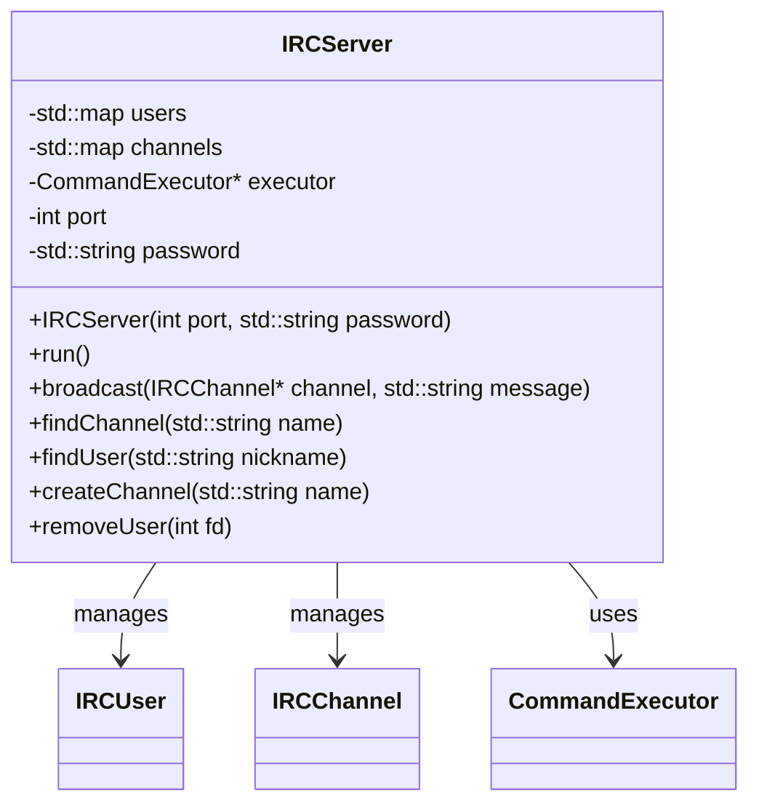
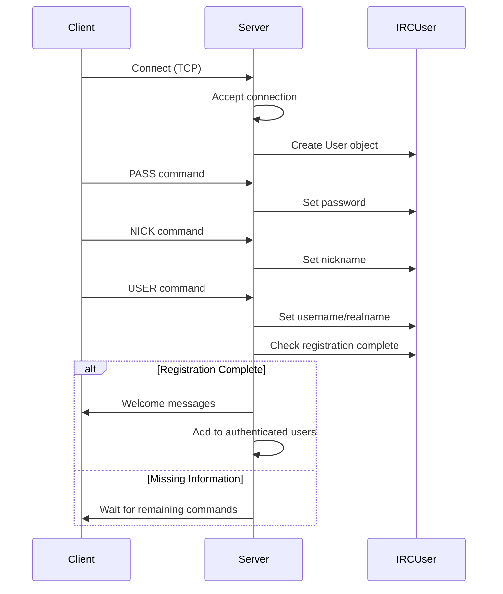

# Server Implementation

## Overview

The IRC server implementation is centered around the `IRCServer` class, which manages all aspects of the server functionality. This class handles network connections, user management, channel management, and command execution.

## Server Architecture



## Key Components

### Socket Management

The server uses non-blocking sockets with `poll()` to handle multiple client connections efficiently:

```cpp
// Initialize socket
int server_fd = socket(AF_INET, SOCK_STREAM, 0);
fcntl(server_fd, F_SETFL, O_NONBLOCK);

// Set up socket options and bind to port

// Main loop
while (true) {
    // Poll for activity on sockets
    poll(fds, nfds, -1);
    
    // Accept new connections
    // Read from clients
    // Process commands
    // Write responses
}
```

### User Authentication Flow



### Command Processing

When a client sends a message, the server:

1. Reads the data from the socket
2. Parses the message into components (prefix, command, parameters)
3. Validates the command syntax
4. Passes the command to the [[command-system|Command Executor]]
5. The command is executed, potentially updating server state
6. Responses are sent back to clients

## Data Structures

### User Management

Users are stored in a map with socket file descriptor as the key:

```cpp
std::map<int, IRCUser*> _users;
```

This allows for efficient lookup of users by their connection fd.

### Channel Management

Channels are stored in a map with channel name as the key:

```cpp
std::map<std::string, IRCChannel*> _channels;
```

This allows for efficient lookup of channels by name.

## Error Handling

The server implements robust error handling:

1. **Socket errors**: Checked after each socket operation
2. **Client disconnection**: Detected via read returning <= 0
3. **Command validation**: Parameters checked before execution
4. **Resource limits**: Maximum connections and buffer sizes enforced
5. **Exception handling**: Try/catch blocks around critical sections

## Performance Considerations

- **Non-blocking I/O**: Allows handling multiple clients without threads
- **Buffer management**: Fixed-size buffers prevent memory exhaustion
- **Map data structures**: O(log n) lookup time for users and channels
- **Command validation**: Early rejection of invalid commands

## Security Features

- **Password authentication**: Optional server password
- **Input validation**: All client input is validated
- **Resource limits**: Prevents DoS attacks
- **Channel operator privileges**: Protected operations

## Related Documentation

- [[entity-management

