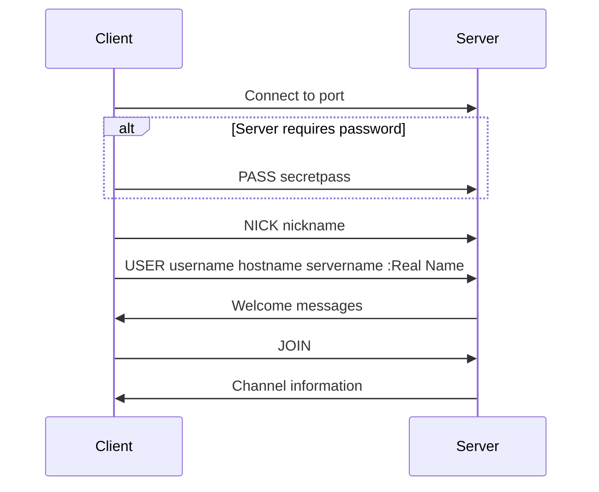

# Setup and Usage

This document provides instructions for building, configuring, and running the IRC server.

## Requirements

- C++ compiler with C++98 support (g++ or clang++)
- GNU Make
- POSIX-compliant operating system (Linux or macOS)
- Network connectivity

## Building the IRC Server

### Standard Build

To build the IRC server with default settings:

```bash
make
```

This will compile the server and create an executable named `ircserv`.

### Build Variants

The Makefile supports several build variants:

| Variant | Command | Description |
|---------|---------|-------------|
| Standard | `make` | Standard build with optimizations |
| Debug | `make debug` | Build with debug symbols and leak sanitizer |
| Logs | `make logs` | Build with verbose logging enabled |
| Clean | `make clean` | Remove object files |
| Full Clean | `make fclean` | Remove object files and executable |
| Rebuild | `make re` | Full clean and rebuild |

### Compilation Flags

The project uses the following compilation flags:

```
CFLAGS = -Wall -Wextra -Werror -std=c++98 -pedantic -ggdb3
```

Additionally:
- On MacOS, `-arch x86_64` is added
- In debug mode, `-fsanitize=leak -g` is added on Linux
- With logging enabled, `-D LOGS=true` is added

## Running the IRC Server

### Basic Usage

```bash
./ircserv [port] [password]
```

Where:
- `port`: Port number for the server (default: 6667)
- `password`: Optional password for client connections

Example:
```bash
./ircserv 6667 secretpass
```

### Command-line Arguments

| Argument | Required | Description |
|----------|----------|-------------|
| Port | Yes | Network port for the server (1024-65535) |
| Password | No | Password required for client connections |

## Connecting with Clients

### Using Standard IRC Clients

You can connect to the server using any standard IRC client:

#### irssi

```bash
# Without password
irssi -c localhost -p 6667

# With password
irssi -c localhost -p 6667 -w secretpass
```

#### hexchat

1. Open HexChat
2. Add a new server:
   - Server: localhost
   - Port: 6667
   - Password: secretpass (if required)
3. Connect to the server

### Client Connection Flow



## Server Operation

### Server Startup

Upon starting, the server:
1. Initializes the socket
2. Binds to the specified port
3. Listens for incoming connections
4. Initializes the command system
5. Enters the main event loop

### Main Event Loop

The server uses non-blocking I/O with `poll()` to handle multiple clients:

```cpp
while (running) {
    // Wait for activity on file descriptors
    poll(fds, nfds, -1);
    
    // Accept new connections
    
    // Process client messages
    
    // Handle disconnections
}
```

### Resource Management

The server carefully manages resources:
- Connected clients (up to MAX_CONNECTIONS)
- Memory for user and channel objects
- Socket file descriptors

## Development Setup

### Adding New Commands

To add a new command:

1. Create header file in `inc/commands/`
2. Create implementation file in `srcs/commands/`
3. Inherit from `BaseCommand`
4. Implement the `execute()` method
5. Register the command in `CommandExecutor::CommandExecutor()`

Example header:
```cpp
#ifndef NEWCOMMAND_HPP
# define NEWCOMMAND_HPP

# include "../IRCDependencies.hpp"

class NewCommand : public BaseCommand {
public:
    NewCommand();
    ~NewCommand();
    
    void execute() const;
};

#endif
```

Example implementation:
```cpp
#include "../../inc/commands/NewCommand.hpp"

NewCommand::NewCommand() : BaseCommand("NEWCMD") {
    this->addAlias("NC");
}

NewCommand::~NewCommand() {
}

void NewCommand::execute() const {
    // Command implementation
}
```

### Running Tests

The project doesn't include an automated test suite, but you can test functionality using:

1. Manual connection with IRC clients
2. Shell scripts to simulate client behavior
3. Monitoring server logs in debug mode

## Troubleshooting

### Common Issues

| Issue | Solution |
|-------|----------|
| Port already in use | Choose a different port |
| Connection refused | Ensure server is running and port is correct |
| Client can't authenticate | Verify correct password |
| Client timeout | Check network connectivity |

### Debug Logging

To enable verbose logging:

```bash
make logs
./ircserv 6667 password
```

Logs will show:
- Client connections and disconnections
- Message processing
- Command execution
- Errors and exceptions

## Related Documentation

- [[architecture|Project Architecture]]
- [[irc-protocol|IRC Protocol Details]]
- [[commands|IRC Commands Reference]]

